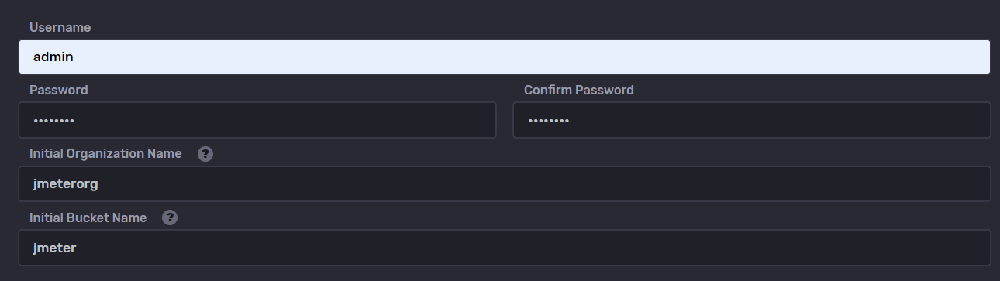
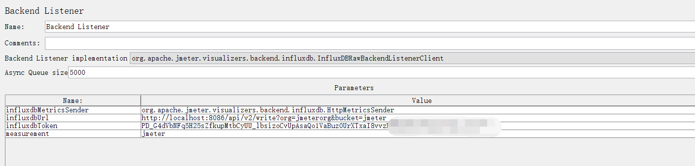
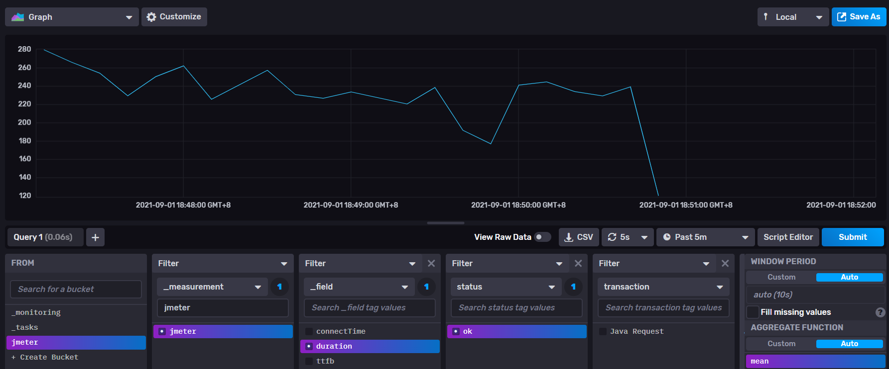

# Jmeter + Grafana + InfluxDB
使用Docker搭建环境
## 软件版本
Jmeter 5.4.1
Grafana 8.1.2
InfluxDB 2.0.3

## 软件启动
1. 修改docker-compose.yml中 influxdb下的volumes本地映射
2. 启动命令
> docker-compose up -d

## 软件配置
### 初始化influxdb
1. 访问http://localhost:8086
2. 点击Get Started
3. 配置username、password、organization、bucket等

4. 配置token
点击左侧菜单》Data》Tokens》Generate Token选择Read/Write Token
选择创建的bucket，点击Save
### 初始化grafana
1. 访问http://localhost:3000  ，初始密码为admin/admin
2. 配置datasource
  > 2.1 点击左侧菜单》设置》Data Sources》Add DataSource》选择influxdb  进入设置页面
 
  > 2.2 Query Language 选择 Flux

  > 2.3 URL 填写 http://influxdb:8086

  > 2.4 Organization 填写 创建的 organization

  > 2.5 Token 填写 在influxdb中创建的token

  > 2.6 Default Bucket 填写 创建的 bucket

  > 2.7 点击Save&test
 
3. 配置Dashbord
下载https://grafana.com/grafana/dashboards/13644 Json文件，这个只针对改进方式显示
点击左侧+按钮，选择Import导入Json，选择数据源点击Import
## 环境测试
### Jmeter配置BackendListener
**默认方式**：

1. BackendListener中选择InfluxDBRawBackendListenerClient
2. influxdbUrl 配置为 http://<你的IP>:8086/api/v2/write?org=<你的org>&bucket=<你的bucket>
3. influxdbToken 配置为 创建的token
4. measurement 配置为jmeter
5. Jmeter中创建一个HTTP Request或Java Request都可以，设置无线循环，运行查看数据结果
6. 直接在查看InfluxDb上的数据显示

**改进方式**：需要Java11
1. 下载jmeter插件https://github.com/mderevyankoaqa/jmeter-influxdb2-listener-plugin/ 
2. BackendListener中选择JMeterInfluxDBBackendListenerClient
3. 填写相应配置即可
4. 然后Jmeter中创建一个HTTP Request或Java Request都可以，设置无线循环，运行查看数据结果

